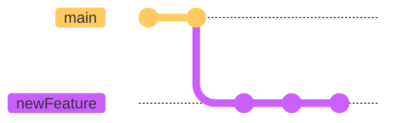
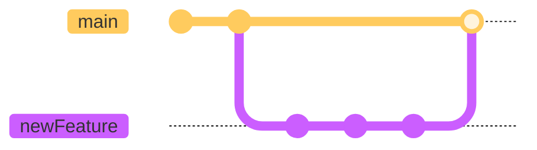
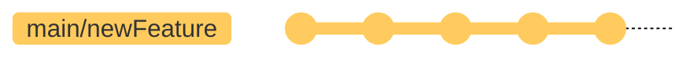

# Git rebase workflow

Nguồn: [Medium](https://medium.com/singlestone/a-git-workflow-using-rebase-1b1210de83e5)

## Tại sao nên dùng `rebase`?

`Rebase` là một trong số các git command có khả năng tích hợp các thay đổi từ một branch vào một branch khác, khá giống với merge, tuy nhiên nó sẽ không tạo ra merge commit

`Rebase` sẽ rewrite lại git commit history, cho nên đây là một command khá rủi ro nếu bất cẩn khi sử dụng

Với `rebase` ta có thể `squash` các commit, gộp nhiều commit lại thành một (hoặc nhiều) commit. Ta có thể sử dụng `squash` khi một bug hay feature được fix/phát triển dưới nhiều commit khác nhau, khi đẩy lên production, ta muốn gộp chung chúng thành một commit duy nhất.

Dưới là Git commit tree



Nếu ta thực hiện merge toàn bộ nhánh `newFeature` vào nhánh `main` thì nhánh `main` sẽ hiển thị toàn bộ commit của nhánh `newFeature` (khuyến mãi thêm 1 merge commit). Điều này về lâu dài sẽ làm cho git tree rất rối.



Thay vì vậy, ta `squash` toàn bộ commit của nhánh `newFeature` thành 1 commit rồi thực hiện `rebase` vào nhánh `main` thì git tree của main sẽ có một commit duy nhất ( hoặc 2 nếu tính cả merge commit khi sử dụng merge)



## Workflow

Workflow với rebase có thể bao gồm các bước sau:

1. **Fetch các thay đổi từ upstream**
    
    ```bash
    git fetch upstream
    ```
    
    

2. **Merge `upstream/master` branch vào local `master` branch**
    
    ```bash
    git checkout master
    git merge upstream/master
    ```
    
    
    
3. **Tạo một branch mới (cho việc fix bug hoặc phát triển tính năng mới)**
    
    ```bash
    git checkout -b issue-1
    ```
    
    
    
4. **Code trên branch đó và thực hiện commit**
    
    
    
5. **Fetch từ upstream lần nữa (trong trường hợp khi đang phát triển thì có các commit mới được thêm vào nhánh master)**
Có thể trên upstream có các thay đổi mới
    
    
    
    Kéo các thay đổi mới về với:
    
    ```bash
    git fetch upstream
    ```
    
    Local sẽ được cập nhật với các thay đổi mới nhất
    
    
    
6. **Rebase và squash branch của bạn từ `upstream/master` , resolve conflicts nếu có**
    
    ```bash
    git rebase -i upstream/master
    ```
    
    Câu lệnh `git rebase -i` sẽ mở default editor (vim hoặc nano) và hiển thị một list các option giống như sau:
    
    ```bash
    pick c42629e Add feature XYZ
    pick 6fa213d Make an update
    pick fdcc8a6 Do some more stuff
    # Rebase e342e4d..fdcc8a6 onto e342e4d (3 commands)
    #
    # Commands:
    # p, pick = use commit
    # r, reword = use commit, but edit the commit message
    # e, edit = use commit, but stop for amending
    # s, squash = use commit, but meld into previous commit
    # f, fixup = like “squash”, but discard this commit’s log message
    # x, exec = run command (the rest of the line) using shell
    # d, drop = remove commit
    #
    # These lines can be re-ordered; they are executed from top to bottom.
    #
    # If you remove a line here THAT COMMIT WILL BE LOST.
    #
    # However, if you remove everything, the rebase will be aborted.
    #
    # Note that empty commits are commented out
    ```
    
    Để `squash` commit thì ta sẽ giữ lại commit gần nhất (commit đầu tiên), để làm vậy, sửa `pick` thành `squash` hoặc `s` từ commit thứ hai trở đi ( nếu không cần giữ lại commit message thì có thể sử dụng option `fixup` hoặc `f`), sau đó lưu file rồi thoát khỏi editor. 
    
    ```bash
    pick c42629e Add feature XYZ
    squash 6fa213d Make an update
    squash fdcc8a6 Do some more stuff
    # Rebase e342e4d..fdcc8a6 onto e342e4d (3 commands)
    #
    # Commands:
    # p, pick = use commit
    # r, reword = use commit, but edit the commit message
    # e, edit = use commit, but stop for amending
    # s, squash = use commit, but meld into previous commit
    # f, fixup = like “squash”, but discard this commit’s log message
    # x, exec = run command (the rest of the line) using shell
    # d, drop = remove commit
    #
    # These lines can be re-ordered; they are executed from top to bottom.
    #
    # If you remove a line here THAT COMMIT WILL BE LOST.
    #
    # However, if you remove everything, the rebase will be aborted.
    #
    # Note that empty commits are commented out
    ```
    
    Sau khi squash, có thể xảy ra merge conflict, thực hiện resolve conflicts rồi chạy
    
    ```bash
    git add
    git rebase --continue
    ```
    
    
    
    
    
7. **Push branch**
    
    Để tạo pull request từ branch mới, cần push lên một branch mới lên `origin` 
    
    ```bash
    git push --set-upstream origin issue-1
    ```
    
    Nếu bạn đã push branch đó lên từ trước thì khi ta dùng `squash` git tree đã thay đổi. Nên cần thêm option `--force` để đẩy code lên và ghi đè vào git tree cũ:
    
    ```bash
    git push --force origin issue-1
    ```
    
    > Note: Không bao giờ rebase hay squash trên nhánh public mà người khác đang làm việc trên đó. Việc này có thể làm xảy ra conflict khi họ cố gắng kéo các thay đổi mới về (git tree trên local của họ và git tree trên origin đã bị thay đổi)
    > 
8. **Tạo pull request**
    
    Sau khi tạo PR và được merge, hãy xoá feature branch trên local và branch bạn fork từ origin
    
    
    
    
