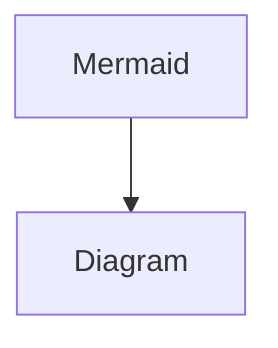

# Golang

## Introduction

- **Chương trình go đơn giản**
    
    Khởi tạo project với go mod init
    
    ```bash
    go mod init example/hello
    ```
    
    ```go
    package main
    
    import "fmt"
    
    func main() {
        fmt.Println("Hello, World!")
    }
    ```
    
    Chạy chương trình
    
    ```bash
    go run .
    ```
    
- **Gọi code từ một external package**
    - Tìm kiếm package tại [pkg.go.dev](http://pkg.go.dev)
    - Thực hiện import và sử dụng package như dưới
        
        ```go
        package main
        
        import "fmt"
        
        import "rsc.io/quote"
        
        func main() {
            fmt.Println(quote.Go())
        }
        ```
        
    - Chạy lệnh sau để tải và cài đặt package mới import
        
        ```go
        go mod tidy
        ```
        

## Create a Go module

- Tạo một module
    - Sử dụng câu lệnh `go mod init` . Lệnh này sẽ tạo một file để tracking code's dependencies kèm version của chúng
    
    ```go
    go mod init example.com/greetings
    ```
    
    - Tạo một file `greeting.go`
    
    ```go
    // Khai báo package greetings
    package greetings
    
    import "fmt"
    
    // Tạo một Hello function để in lời chào (greetings)
    func Hello(name string) string {
        // Trả về lời chào kèm theo tham số name được truyền vào
        message := fmt.Sprintf("Hi, %v. Welcome!", name) // Khai báo biến message
        return message
    }
    ```
    
    Cấu trúc của một function trong go như sau:
    
    
    
    Tao có thể khai báo vào khởi tạo giá trị của một biến trong golang bằng toán tử `:=`. Ngoài cách này, sẽ có một cách tương tự để tách biệt phần khai báo vào khởi tạo giá trị cho biến:
    
    ```go
    var message string
    message = fmt.Sprintf("Hi, %v. Welcome!", name)
    ```
    
- Sử dụng code từ một module khác
    
    Ta đã có module `greetings`, giờ tạo thêm một module `hello` ngang hàng với module `greetings`
    
    ```bash
    mkdir hello
    cd hello
    go mod init example.com/hello
    ```
    
    Tạo một file `hello.go` 
    
    ```go
    package main
    
    import (
        "fmt"
    
        "example.com/greetings" // Import module greetings
    )
    
    func main() {
        // Tạo một lời chào rồi in ra màn hình sử dụng code từ module greetings
        message := greetings.Hello("Gladys")
        fmt.Println(message)
    }
    ```
    
    Dùng lệnh sau trong thư mục hello để thực hiện locate vị trí của module greetings
    
    ```go
    go mod edit -replace example.com/greetings=../greetings
    go mod tidy
    ```
    
     Khi quá trình hoàn tất thì file `go.mod`trong module hello sẽ trông như thế này
    
    ```go
    module example.com/hello
    
    go 1.16
    
    replace example.com/greetings => ../greetings
    
    require example.com/greetings v0.0.0-00010101000000-000000000000
    ```
    
    Bây giờ ta có thể chạy code của module hello
    
    ```go
    go run .
    ```
    
- Return and handle an error
    
    Để trả về một Error, có thể làm như sau:
    
    ```go
    package greetings
    
    import (
        "errors" // Cần có pakage này để có thể sử dụng errors.New
        "fmt"
    )
    
    // Hàm này trả về đoạn string dựa vào tham số name
    func Hello(name string) (string, error) {
        // Nếu không có tham số name thì cần trả về một error kèm theo message
        if name == "" {
            return "", errors.New("empty name")
        }
    
        // Nếu có tham số name thì thực thi hàm và trả về kết quả
        message := fmt.Sprintf("Hi, %v. Welcome!", name)
    		// Kết quả trả về gồm có hai giá trị, một string và một error
    		// nil tương đương với null, trong trường hợp này nghĩa là không có lỗi
        return message, nil
    }
    ```
    
    Để handle khi có Error:
    
    ```go
    package main
    
    import (
        "fmt"
        "log"
    
        "example.com/greetings"
    )
    
    func main() {
    		// Tạo một logger, bao gồm log entry prefix và flag để disable
    		// việc in ra màn hình thời gian, source file và line number
        log.SetPrefix("greetings: ")
        log.SetFlags(0)
    
        // Chạy hàm Hello từ module greetings
        message, err := greetings.Hello("")
        // Nếu có lỗi xảy ra thì in ra ngoài console rồi exit chương trình
        if err != nil {
            log.Fatal(err)
        }
    
        // Nếu không lỗi thì in messsage ra ngoài console
        fmt.Println(message)
    }
    ```
    
- Slice (array) trong Go
    
    Kiểu dữ liệu Slice giống như Array tuy nhiên size của nó có thể thay đổi tuỳ thuộc vào số lượng phần tử.
    
    Hàm sau sử dụng slice để có thể trả về ngẫu nhiên một đoạn string
    
    ```go
    import (
        "math/rand"
    )
    func randomFormat() string {
        // Một slice bao gồm nhiều string format
        formats := []string{
            "Hi, %v. Welcome!",
            "Great to see you, %v!",
            "Hail, %v! Well met!",
        }
    
        // Trả về ngẫu nhiên một string trong slice trên dựa vào index
        return formats[rand.Intn(len(formats))]
    }
    ```
    
- Maps (dict, hashes) trong Go
    
    Maps trong Go là dạng key-value pair giống như kiểu dict trong python
    
    Để tạo một map trong golang, dùng keyword `make`
    
    ```go
    //make(map[key-type]val-type)
    m := make(map[string]int)
    m["k1"] = 7
    m["k2"] = 13
    fmt.Println("map:", m)
    map: map[k1:7 k2:13]
    ```
    
- Test
    
    Để viết test với Go, import package `testing`. Tạo các file có đuôi `_test.go` để khi dùng lệnh `go test` sẽ tự tìm và chạy các file test đó
    
    ```go
    package greeting
    
    import (
        "testing"
        "regexp"
    )
    
    // TestHelloName calls greetings.Hello with a name, checking
    // for a valid return value.
    // Test function luôn nhận tham số là một con trỏ tới package testing
    // Con trỏ này có thể được sử dụng để báo cáo và logging khi chạy test
    func TestHelloName(t *testing.T) {
        name := "Gladys"
        want := regexp.MustCompile(`\b`+name+`\b`)
        msg, err := Hello("Gladys")
        if !want.MatchString(msg) || err != nil {
            t.Fatalf(`Hello("Gladys") = %q, %v, want match for %#q, nil`, msg, err, want)
        }
    }
    
    // TestHelloEmpty calls greetings.Hello with an empty string,
    // checking for an error.
    func TestHelloEmpty(t *testing.T) {
        msg, err := Hello("")
        if msg != "" || err == nil {
            t.Fatalf(`Hello("") = %q, %v, want "", error`, msg, err)
        }
    }
    ```
    
    Chạy lệnh sau để Go lang tự tìm các file test và chạy
    
    ```go
    go test
    // PASS
    // ok      example.com/greeting    0.101s
    ```
    
- Biên dịch và cài đặt chương trình
    - `go build` : Biên dịch packages, kèm theo các dependencies nhưng không cài đặt
    - `go instal`: Như trên nhưng có cài đặt
    
    Hiển thị path nơi mà go sẽ cài chương trình
    
    ```go
    go list -f '{{.Target}}'
    // -> /Users/macbook/go/bin/hello
    ```
    
    Thêm thư mục cài đặt của Go và path của system shell
    
    ```go
    export PATH=$PATH:/path/to/your/install/directory
    ```
    

## Multi-module workspaces

## Phát triển RESTful API với Gin

```go
go mod init example.com/go-gin
```

Tạo file `main.go` với nội dung như sau

```go
package main

import (
	"net/http"

	"github.com/gin-gonic/gin" // Import Gin
)

// Khai báo kiểu album
type album struct {
	ID     string  `json:"id"`
	Title  string  `json:"title"`
	Artist string  `json:"artist"`
	Price  float64 `json:"price"`
}

// Tạo một slice các album
var albums = []album{
	{ID: "1", Title: "Blue Train", Artist: "John Coltrane", Price: 56.99},
	{ID: "2", Title: "Jeru", Artist: "Gerry Mulligan", Price: 17.99},
	{ID: "3", Title: "Sarah Vaughan and Clifford Brown", Artist: "Sarah Vaughan", Price: 39.99},
}

// Trả về tất cả các album dưới dạng JSON
// gin.Context chứa thông tin của request, validate và chuyển data thành JSON...

func getAlbums(c *gin.Context) {
	// Context.IndentedJSON dùng để serialize struct thành dạng JSON để thêm
	// vào response, tham số đầu là status code, tham số thứ hai là data ca
	// serialize và thêm vào response
	c.IndentedJSON(http.StatusOK, albums)
}

func main() {
	router := gin.Default()
	
	// Tạo một GET handler gắn với path /albums
	router.GET("/albums", getAlbums)

	// Gắn router vào http.Server và chạy server tại localhost:8080
	err := router.Run("localhost:8080")
	if err != nil {
		return
	}
}
```

Add các module cần thiết

```bash
go get .
```

Chạy server

```bash
go run .
```

Test endpoint GET lấy tất cả những albums

```bash
curl http://localhost:8080/albums
```

Kết quả

```json
[
        {
                "id": "1",
                "title": "Blue Train",
                "artist": "John Coltrane",
                "price": 56.99
        },
        {
                "id": "2",
                "title": "Jeru",
                "artist": "Gerry Mulligan",
                "price": 17.99
        },
        {
                "id": "3",
                "title": "Sarah Vaughan and Clifford Brown",
                "artist": "Sarah Vaughan",
                "price": 39.99
        }
]
```

## Generics

```go
package main

import "fmt"

// Khai báo interface Number dạng union của int64 và float64
type Number interface {
	int64 | float64
}

func main() {
	// Khởi tạo bảng map string-integer
	ints := map[string]int64{
		"first":  34,
		"second": 12,
	}

	// Khởi tạo bảng map string-float
	floats := map[string]float64{
		"first":  35.98,
		"second": 26.99,
	}

	fmt.Printf("Non-Generic Sums: %v and %v\n",
		SumInts(ints),
		SumFloats(floats))

	fmt.Printf("Generic Sums: %v and %v\n",
		SumIntsOrFloats(ints),
		SumIntsOrFloats(floats))

	fmt.Printf("Generic Sums with Constraint: %v and %v\n",
		SumNumbers(ints),
		SumNumbers(floats))
}

// Tính tổng các giá trị trong bảng map string-integer
func SumInts(m map[string]int64) int64 {
	var s int64
	for _, v := range m {
		s += v
	}
	return s
}

// Tính tổng các giá trị trong bảng map string-float
func SumFloats(m map[string]float64) float64 {
	var s float64
	for _, v := range m {
		s += v
	}
	return s
}

// SumIntsOrFloats tính tổng các giá trị trong bảng map, nhận cả kiểu
// int hoặc float

// Trong phần khai báo có hai kiểu dữ liệu K và V, rồi trong phần khai
// báo tham số khai báo một tham số map có kiểu dữ liệu là map[K]V.
// Function sẽ trả về kiểu dữ liệu V

// comparable là một contrain (ràng buộc) được predefine trong Go. Thường
// được sử dụng trong những trường hợp như này. Nó cho phép giá trị của
// bất cứ kiểu dữ liệu nào cũng có thể được sử dụng làm toán hạng (operand)
// cho phép so sánh == và != . Go bắt buộc key của map phải comparable

// Kiểu dữ liệu V được khai báo là một union: int64 và float64
// m được khai báo là kiểu dữ liệu map[K]V
func SumIntsOrFloats[K comparable, V int64 | float64](m map[K]V) V {
	var s V
	for _, v := range m {
		s += v
	}
	return s
}

// SumNumbers tương tự như hàm phía trên nhưng sử dụng Number interface
func SumNumbers[K comparable, V Number](m map[K]V) V {
	var s V
	for _, v := range m {
		s += v
	}
	return s
}
```

## Getting started with fuzzing

Go có kỹ thuật fuzzing để tự động generate fake data để test

file `main.go`

```go
package main

import (
    "errors"
    "fmt"
    "unicode/utf8"
)

func main() {
    input := "The quick brown fox jumped over the lazy dog"
    rev, revErr := Reverse(input)
    doubleRev, doubleRevErr := Reverse(rev)
    fmt.Printf("original: %q\n", input)
    fmt.Printf("reversed: %q, err: %v\n", rev, revErr)
    fmt.Printf("reversed again: %q, err: %v\n", doubleRev, doubleRevErr)
}

// Hàm để reverse một string
func Reverse(s string) (string, error) {
    if !utf8.ValidString(s) {
        return s, errors.New("input is not valid UTF-8")
    }
    r := []rune(s)
    for i, j := 0, len(r)-1; i < len(r)/2; i, j = i+1, j-1 {
        r[i], r[j] = r[j], r[i]
    }
    return string(r), nil
}
```

file `reverse_test.go`

```go
package main

import (
    "testing"
    "unicode/utf8"
)

// Hàm để test hàm reverse
func FuzzReverse(f *testing.F) {
    testcases := []string{"Hello, world", " ", "!12345"}
    for _, tc := range testcases {
        f.Add(tc) // Use f.Add to provide a seed corpus
    }
    f.Fuzz(func(t *testing.T, orig string) {
        rev, err1 := Reverse(orig)
        if err1 != nil {
            return
        }
        doubleRev, err2 := Reverse(rev)
        if err2 != nil {
            return
        }
        if orig != doubleRev {
            t.Errorf("Before: %q, after: %q", orig, doubleRev)
        }
        if utf8.ValidString(orig) && !utf8.ValidString(rev) {
            t.Errorf("Reverse produced invalid UTF-8 string %q", rev)
        }
    })
}
```



